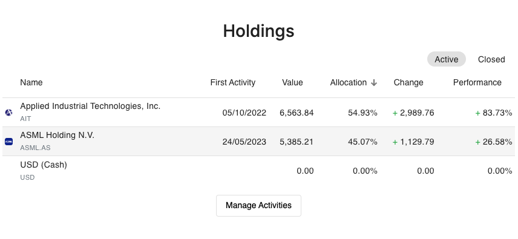
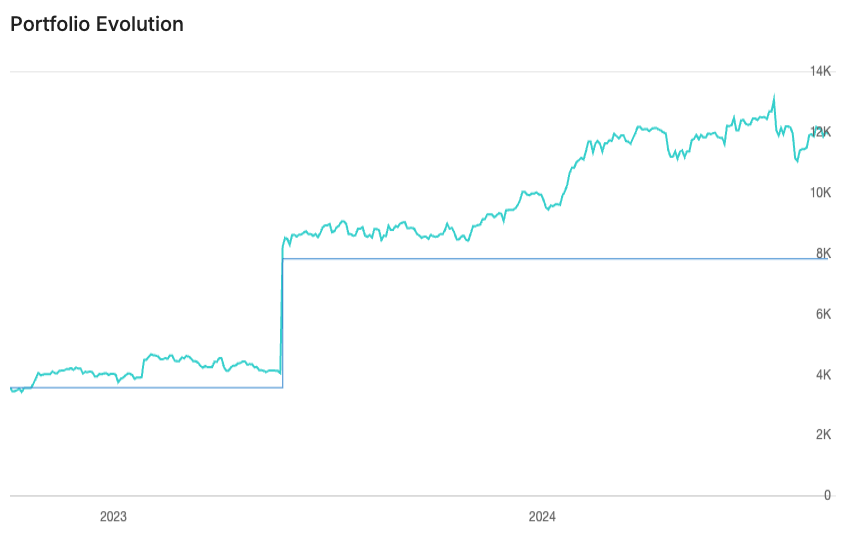
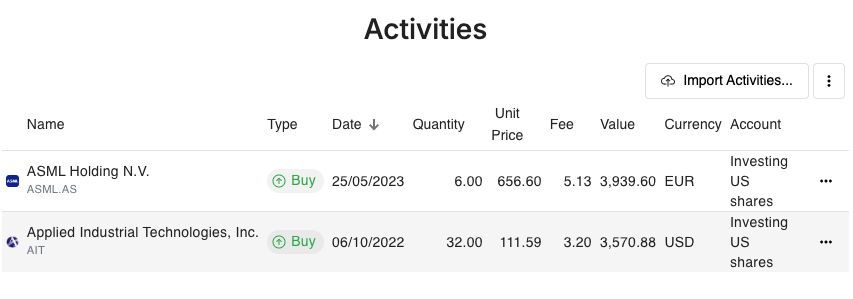
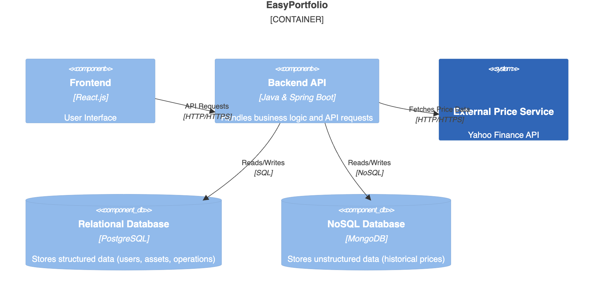

## Índice

0. [Ficha del proyecto](#0-ficha-del-proyecto)
1. [Descripción general del producto](#1-descripción-general-del-producto)
2. [Arquitectura del sistema](#2-arquitectura-del-sistema)
3. [Modelo de datos](#3-modelo-de-datos)
4. [Especificación de la API](#4-especificación-de-la-api)
5. [Historias de usuario](#5-historias-de-usuario)
6. [Tickets de trabajo](#6-tickets-de-trabajo)
7. [Pull requests](#7-pull-requests)

---

## 0. Ficha del proyecto

### **0.1. Tu nombre completo:**
Enrique Rochina Ramond

### **0.2. Nombre del proyecto:**
WealthTrack

### **0.3. Descripción breve del proyecto:**
WealthTrack es una aplicación que permite a los usuarios llevar el seguimiento de su patrimonio personal de manera sencilla y eficiente. 

Quiere ser capaz de mostrar la evolución del patrimonio a lo largo del tiempo, calculando para ello el valor de cada activo en el momento de mostrar las gráficas y obteniendo de fuentes públicas los datos de cotizacion de los activos como acciones y fondos de inversión.

### **0.4. URL del proyecto:**

https://wealthtrack.chickenkiller.com/
Para contemplar la funcionalidad, es necesario usar el usuario y contraseña de demo:  
```
Usuario: alpaca.louse1682@eagereverest.com
Contraseña: Ai4devsTeam!
```

### **0.5. URL o archivo comprimido del repositorio**

https://github.com/rochinae/AI4Devs-finalproject-private


---

## 1. Descripción general del producto

### **1.1. Objetivo:**
WealthTrack es una aplicación para llevar el seguimiento de tu patrimonio personal de manera sencilla y eficiente.
Intenta ser capaz de manejar cualquier tipo de patrimonio, desde acciones, fondos de inversión, criptomonedas, depósitos bancarios a plazo fijo, cuentas de ahorro, hasta bienes raices.


### **1.2. Características y funcionalidades principales:**
Tiene una página en la que ver la lista de todos los activos que se tienen, así como su valor actual y su valor inicial. Igualmente, se proporciona una gráfica que muestra la evolución del patrimonio a lo largo del tiempo.

Para el caso de activos con precios públicos (acciones, fondos de inversión, etc), se obtiene la cotización de los mismos de fuentes públicas como Yahoo Finance.

Otra funcionalidad será la de plasmar la lista de operaciones que se han realizado, junto con la fecha y el precio de la operación. Para el caso de operaciones de venta, se mostrará si ha habido plusvalía o minusvalía, y en cuánto.

También quiere ofrecer la capacidad de importar muchas operaciones de manera masiva, para no tener que introducir cada una de ellas manualmente.


### **1.3. Diseño y experiencia de usuario:**

#### Pantalla 1: Resumen de Activos

La pantalla muestra una lista de todos los activos en una tabla organizada. Cada fila de la tabla incluye el nombre del activo, su tipo (acciones, fondos, criptomonedas, etc.), el valor inicial y el valor actual. En una pantalla


#### Pantalla 2: Evolución global del patrimonio
Hay una gráfica lineal que muestra la evolución del valor total del patrimonio a lo largo del tiempo. La gráfica tiene un eje X con fechas y un eje Y con valores monetarios. La interfaz es limpia y moderna, con un diseño minimalista y colores que contrastan, como azul turquesa y blanco.



#### Pantalla 3: Historial de Operaciones

La pantalla muestra una tabla con el historial de operaciones realizadas. Cada fila muestra la fecha, tipo de operación (compra/venta), nombre del activo, cantidad, precio por unidad, y el resultado (plusvalía o minusvalía) con el monto. La tabla está organizada de manera cronológica, con filtros para buscar por fecha o tipo de operación. La parte superior tiene un encabezado con botones para "Importar Operaciones" y "Añadir Nueva Operación", ambos con íconos sencillos.



####Pantalla 4: Importación de Operaciones Masivas

Esta pantalla incluye un formulario simple para importar operaciones en masa. Tiene un área destacada para arrastrar y soltar archivos (por ejemplo, un CSV) o un botón para cargar archivos desde el dispositivo. Debajo del área de importación, hay una lista de los archivos recientemente cargados, con su estado de procesamiento (completado, en progreso, error). Al lado, hay un botón para iniciar la importación y otro para cancelar. La interfaz es clara y funcional, con indicaciones para guiar al usuario.

### **1.4. Instrucciones de instalación:**
Para obtener instrucciones detalladas sobre cómo instalar y configurar WealthTrack, consulte el archivo [instalacion.md](./docs/instalacion.md).

---

## 2. Arquitectura del Sistema

### **2.1. Diagrama de arquitectura:**
```mermaid
C4Component
    title WealthTrack - Component Diagram

    Container_Boundary(c1, "WealthTrack") {
        Component(f1, "Frontend", "React.js", "User Interface")
        Component(b1, "Backend API", "Java & Spring Boot", "Handles business logic and API requests")
        System(e1, "External Price Service", "Yahoo Finance API", "Provides asset price data")
        ComponentDb(db1, "Relational Database", "PostgreSQL", "Stores structured data (users, assets, operations)")
        ComponentDb(db2, "NoSQL Database", "MongoDB", "Stores unstructured data (historical prices)")
    }

    Rel(f1, b1, "API Requests", "HTTP/HTTPS")
    Rel(b1, db1, "Reads/Writes", "SQL")
    Rel(b1, db2, "Reads/Writes", "NoSQL")
    Rel(b1, e1, "Fetches Price Data", "HTTP/HTTPS")
    ```


La arquitectura de la aplicación es bastante sencilla, en la que se prima el "time-to-market" y simplicidad en el despliegue en el cloud. La única complejidad está en el uso de la aplicación MongoDB para almacenar los datos históricos de cotización de los activos, preveyendo que la cantidad de datos puede ser muy grande, y así no penalizar la base de datos SQL en la que tengamos almacenados el resto de datos.

Cierto es que la tecnología utilizada


### **2.2. Descripción de componentes principales:**

### **1. Frontend**
**Tecnología:** React.js + Bootstrap
**Descripción:** React.js es una biblioteca de JavaScript para construir interfaces de usuario. Es mantenida por Facebook y una comunidad de desarrolladores individuales y empresas. También se prevee el uso de Bootstrap para obtener un diseño de la interfaz de usuario más atractivo y moderno, con coste limitado. Para ello, utilizaremos React-Bootstrap, que es la librería de componentes de Bootstrap para React.
**Ventajas:**
- Componentización: Permite construir interfaces de usuario a partir de componentes reutilizables.
- Virtual DOM: Mejora el rendimiento al minimizar las actualizaciones del DOM real.
- Ecosistema Rico: Amplia gama de bibliotecas y herramientas disponibles.
- SEO Amigable: Con el uso de frameworks como Next.js, se puede mejorar el SEO mediante renderizado del lado del servidor.


### **2. Backend API**
**Tecnología:** Java y Spring Boot
**Descripción:** Spring Boot es un framework de Java que simplifica el desarrollo de aplicaciones basadas en Spring, proporcionando configuraciones predeterminadas y herramientas para crear aplicaciones rápidamente.
**Ventajas:**
- Configuración Automática: Reduce la cantidad de configuración manual necesaria.
- Ecosistema Spring: Acceso a una amplia gama de proyectos Spring (Spring Security, Spring Data, etc.).
- Escalabilidad: Facilita la creación de aplicaciones escalables y robustas.
- Comunidad y Soporte: Amplia comunidad y soporte empresarial disponible.
Mejoras en el rendimiento: Java 21 incluye optimizaciones de rendimiento que pueden hacer que las aplicaciones sean más rápidas y eficientes.
Nuevas características del lenguaje: Java 21 introduce nuevas características del lenguaje que pueden simplificar el código y mejorar la productividad del desarrollador.
- Mejoras en la seguridad: Java 21 incluye actualizaciones de seguridad que pueden ayudar a proteger la aplicación contra vulnerabilidades.
- Soporte a largo plazo (LTS): Java 21 es una versión LTS, lo que significa que recibirá actualizaciones y soporte a largo plazo, proporcionando estabilidad y seguridad a largo plazo.

### **3. Relational Database (PostgreSQL)**
**Tecnología:** PostgreSQL
**Descripción:** PostgreSQL es un sistema de gestión de bases de datos relacional y objeto-relacional de código abierto.
**Ventajas:**
- ACID Compliance: Garantiza transacciones seguras y consistentes.
- Extensibilidad: Soporta tipos de datos personalizados, funciones, operadores, etc.
- Rendimiento: Optimizado para consultas complejas y grandes volúmenes de datos.
- Comunidad Activa: Amplia documentación y soporte de la comunidad.

### **4. NoSQL Database (MongoDB)**
**Tecnología:** MongoDB
**Descripción:** MongoDB es una base de datos NoSQL orientada a documentos que almacena datos en formato BSON (una extensión de JSON).
**Ventajas:**
- Flexibilidad: Permite almacenar datos no estructurados y semi-estructurados.
- Escalabilidad Horizontal: Facilita la distribución de datos a través de múltiples servidores.
- Consultas Ricas: Soporta consultas ad-hoc, indexación y agregaciones.
- Desempeño: Optimizado para grandes volúmenes de datos y alta disponibilidad.

### **5. Authentication Service (JWT)**
**Tecnología:** JSON Web Tokens (JWT)
Descripción: JWT es un estándar abierto para la creación de tokens de acceso que permiten la verificación de identidad y la transmisión segura de información entre partes.
Ventajas:
Seguridad: Los tokens están firmados y pueden ser encriptados.
Descentralización: No requiere almacenamiento de sesión en el servidor.
Escalabilidad: Facilita la autenticación en aplicaciones distribuidas y microservicios.
Interoperabilidad: Compatible con múltiples lenguajes y plataformas.


### **6. External Price Service (Yahoo Finance API)**
**Tecnología:** Yahoo Finance API
**Descripción:** Un servicio externo que proporciona datos de precios de activos financieros en tiempo real.
**Ventajas:**
- Actualización en Tiempo Real: Proporciona datos de precios actualizados.
- Cobertura Amplia: Soporta una amplia gama de activos financieros.
- Facilidad de Uso: API bien documentada y fácil de integrar.
- Confiabilidad: Servicio confiable y ampliamente utilizado en la industria.

Estos componentes, combinados, proporcionan una arquitectura robusta, escalable y eficiente para la aplicación EasyPortfolio, permitiendo un rápido "time-to-market" y una experiencia de usuario rica y funcional.    

### **2.3. Descripción de alto nivel del proyecto y estructura de ficheros**

> Representa la estructura del proyecto y explica brevemente el propósito de las carpetas principales, así como si obedece a algún patrón o arquitectura específica.

### **2.4. Infraestructura y despliegue**

> Detalla la infraestructura del proyecto, incluyendo un diagrama en el formato que creas conveniente, y explica el proceso de despliegue que se sigue

### **2.5. Seguridad**

Se ha usado JWT para la autenticación de usuarios, dejando la página de login en auth0.com así como el registro de los usuarios en esta plataforma.
Este token de acceso se guarda en el Local Storage del navegador y se envía en cada petición al backend.

### **2.6. Tests**

Para la primera historia de usuario, se han creado tests unitarios para los servicios y controladores, usando una estrategia de desarrollo TDD.
Se ha usado JUnit para la realización de los tests unitarios, como los de integración, usando SpringBoot. Desafortunadamente, los tests de integración daba problemas con la carga de librerías así que lo he dejado para más tarde, ya que estaba generando retrasos en el resto del proyecto.
---

## 3. Modelo de Datos

### **3.1. Diagrama del modelo de datos:**
```mermaid
erDiagram
    PORTFOLIOS ||--o{ ACTIVOS : contains
    PORTFOLIOS ||--o{ VALORIZACIONESDIARIAS : has
    ACTIVOS ||--o{ PRECIOSACTIVOS : has

    PORTFOLIOS {
        int id PK
        varchar nombre
        varchar divisa_principal
        date fecha_creacion
        decimal valor_actual
    }

    ACTIVOS {
        int id PK
        int portfolio_id FK
        varchar tipo
        varchar nombre
        varchar ticker
        varchar divisa
        decimal tipo_cambio_divisa_compra
        date fecha_compra
        int numero_titulos
        decimal precio_medio_unitario
        decimal coste_comisiones
        decimal precio_total_coste
        decimal precio_actual
        decimal ultima_valorizacion
        date fecha_actualizacion
        decimal tasa_interes_nominal
        int plazo_inversion
        decimal precio_unitario_venta
        decimal tipo_cambio_divisa_venta
    }

    VALORIZACIONESDIARIAS {
        int id PK
        int portfolio_id FK
        date fecha
        decimal valor
    }

    PRECIOSACTIVOS {
        int id PK
        int activo_id FK
        date fecha
        decimal precio_cierre
        decimal precio_apertura
        decimal precio_maximo
        decimal precio_minimo
        int volumen
    }   
```

---

## 4. Especificación de la API

El frontend se comunica con el backend mediante una API REST, definida en el archivo @openapi.yaml.
Los endpoints necesitan la presencia del token de acceso en el header de la petición, que se obtiene del login en auth0.com.

Éste implicitamente da el nombre de usuario, el cual se asocia a un portfolio, y esto se tiene en cuenta en los diferentes endpoints. Está previsto que los diferentes endpoints hagan verificación de accesos, que sea relativo al portfolio del usuario conectado.

### **4.1. Detalles de portfolio**
/api/portfolio
```json
{
    "id": 1,
    "nombre": "Ai4devs",
    "divisaPrincipal": "USD",
    "fechaCreacion": "2024-02-20",
    "valorActual": 20000.0
}
```

### **4.2. Listado de activos de un portfolio**
/api/activos/{portfolioId}
```json
[
    {
        "id": 1,
        "portfolioId": 1,
        "tipo": null,
        "nombre": "Microsoft",
        "ticker": "MSFT",
        "divisa": "USD",
        "tipoCambioDivisaCompra": 1.000000,
        "fechaCompra": "2024-08-14",
        "numeroTitulos": 20,
        "precioMedioUnitario": 200.000000,
        "costeComisiones": 2.00,
        "precioTotalCoste": 4002.00,
        "precioActual": 300.00,
        "ultimaValorizacion": 6000.00,
        "fechaActualizacion": null,
        "tasaInteresNominal": null,
        "plazoInversion": null,
        "precioUnitarioVenta": null,
        "tipoCambioDivisaVenta": null,
        "ganancia": 1998.0,
        "gananciaPorcentaje": 49.925
    },
    {
        "id": 2,
        "portfolioId": 1,
        "tipo": null,
        "nombre": "Nvidia",
        "ticker": "NVDA",
        "divisa": "USD",
        "tipoCambioDivisaCompra": 1.000000,
        "fechaCompra": "2024-08-14",
        "numeroTitulos": 20,
        "precioMedioUnitario": 100.000000,
        "costeComisiones": 2.00,
        "precioTotalCoste": 2002.00,
        "precioActual": 130.00,
        "ultimaValorizacion": 2600.00,
        "fechaActualizacion": null,
        "tasaInteresNominal": null,
        "plazoInversion": null,
        "precioUnitarioVenta": null,
        "tipoCambioDivisaVenta": null,
        "ganancia": 598.0,
        "gananciaPorcentaje": 29.8701
    }
]
```

### **4.3. Listado de valorizaciones del portfolio**
/api/valorizacion-diaria/1
```json
[
    {
        "id": 3,
        "portfolioId": 1,
        "fecha": "2024-10-08",
        "valor": 18700.00
    },
    {
        "id": 2,
        "portfolioId": 1,
        "fecha": "2024-10-09",
        "valor": 18400.00
    },
    {
        "id": 1,
        "portfolioId": 1,
        "fecha": "2024-10-10",
        "valor": 19900.00
    },
    {
        "id": 4,
        "portfolioId": 1,
        "fecha": "2024-10-14",
        "valor": 20000.00
    }
]
```


---

## 5. Historias de Usuario

```csv
Id,Summary, Reporter, Issue Type, Priority
1, Registro de Usuario, enrique.rochina@gmail.com, Story, 100
2, Inicio de Sesión, enrique.rochina@gmail.com, Story, 110
3, Visualización de Resumen de Activos, enrique.rochina@gmail.com, Story, 400
4, Visualización de Evolución Global del Patrimonio, enrique.rochina@gmail.com, Story, 350
5, Visualización de Historial de Operaciones, enrique.rochina@gmail.com, Story, 200
6, Importación Masiva de Operaciones, enrique.rochina@gmail.com, Story, 300
7, Adición de Nueva Operación, enrique.rochina@gmail.com, Story, 350
8, Actualización de Datos de Activos desde Yahoo Finance, enrique.rochina@gmail.com, Story, 300
9, Gestión de Perfil de Usuario, enrique.rochina@gmail.com, Story, 80
10, Exportación de Datos de Activos, enrique.rochina@gmail.com, Story, 50
11, Notificaciones de Cambios en el Valor de Activos, enrique.rochina@gmail.com, Story, 100
12, Filtrado y Búsqueda en Historial de Operaciones, enrique.rochina@gmail.com, Story, 180
13, Visualización de Detalles de un Activo, enrique.rochina@gmail.com, Story, 380
14, Configuración de Preferencias de Visualización, enrique.rochina@gmail.com, Story, 100
15, Gestión de Seguridad y Autenticación con JWT, enrique.rochina@gmail.com, Story, 120
16, Soporte Multimoneda para Activos, enrique.rochina@gmail.com, Story, 190
```

---

## 6. Tickets de trabajo
Todos se han creado en https://enriquer.atlassian.net/jira/software/projects/SCRUM/boards/1

### 6.1 Implementar inicio de sesión en el frontend
Crear endpoint para autenticar usuarios y generar JWT. Integrar el frontend con Auth0.

### 6.2 Implementar autenticación en el backend con JWT 
Modificar el frontend para que las llamadas se inyecte el token de acceso en el header.
Modificar el backend para que todos los endpoints necesiten autenticación y se validen mediante el token.

### 6.3 Crear pantalla de resumen de activos
Desarrollar la interfaz de usuario para mostrar la lista de activos y su valor actual

### 6.4 Crear pantalla de evolución global del patrimonio
Desarrollar la interfaz de usuario para mostrar la gráfica de evolución del patrimonio


## 7. Pull Requests

**Pull Request 1**
https://github.com/rochinae/AI4Devs-finalproject-private/pull/1
Contiene varios tickets de trabajo, en realidad se me olvidó separarlos en diferentes pull requests.
En realidad tiene una base bastante común y todavía era una fase de pruebas en la que todo era bastante inseguro de que fuera a funcionar.

**Pull Request 2**
https://github.com/rochinae/AI4Devs-finalproject-private/pull/2
Implementación de la autenticación con JWT, tanto en el frontend como en el backend.

**Pull Request 3**
Intento de gestionar la parte infra con Terraform/Opentofu (fallido)
https://github.com/rochinae/AI4Devs-finalproject-private/pull/5/files
Muchos problemas con los permisos, parecido a durante la sesión que tuvimos en clase.
Me hizo perder mucho tiempo, durante mi última semana de trabajo, y no lo he conseguido hacer funcionar.

**Pull Request 4**
https://github.com/rochinae/AI4Devs-finalproject-private/commit/e03f4271054f9a6e1a3987e6165735b9cedc186b
Añadiendo el Continuous Integration con Github Actions

**Pull Request 5**
Añadiendo pantalla detalles de activo (inacabada)
https://github.com/rochinae/AI4Devs-finalproject-private/pull/6

